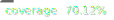

# Portfolio - Leonardo Grigorio Ferreira

 

Welcome to my portfolio! This project is a showcase of my professional journey, skills, and projects. It's built to provide a clear and intuitive experience for users to explore my work and learn more about me.

## Technologies

- 
- 
- 
- 
- 

## Preview

## Author

**Leonardo Grigorio Ferreira**

  

Thank you for visiting my portfolio! Feel free to connect or reach out.
